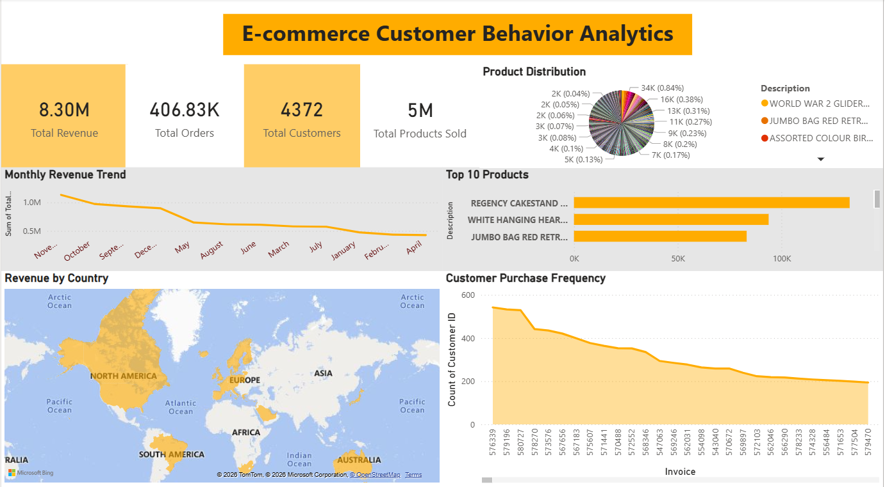

# E-Commerce Customer Behavior Analytics 📊

An interactive Power BI dashboard project that analyzes customer purchasing behavior, revenue trends, product performance, and geographical sales distribution using the Online Retail dataset.

The project demonstrates the complete data analytics workflow — from raw data cleaning and preprocessing to creating insightful visualizations and business dashboards.

---

# 📌 Project Overview

This project aims to extract meaningful insights from e-commerce transaction data and visualize customer purchasing patterns through an interactive Power BI dashboard.

The dashboard helps businesses understand:

- Revenue performance over time
- Customer purchasing behavior
- Product sales performance
- Country-wise revenue contribution
- Product demand distribution
- Customer purchase frequency

---

# 🗂 Dataset Information

## 1️⃣ `online_retail.csv.gz`
This is the original raw dataset containing online retail transactions.

### Dataset Includes:
- Invoice details
- Product descriptions
- Quantity purchased
- Unit prices
- Customer IDs
- Country information
- Transaction timestamps

---

## 2️⃣ `clean_ecommerce_data.csv.gz`
This is the cleaned and preprocessed dataset used for dashboard creation and analysis.

### Cleaning & Transformation Performed:
- Removed missing/null values
- Removed duplicate records
- Filtered cancelled transactions
- Fixed incorrect data types
- Standardized column names
- Created calculated Revenue column
- Processed date columns for time analysis
- Handled missing customer IDs

---

# 🛠 Tools & Technologies Used

| Tool | Purpose |
|------|---------|
| Power BI | Dashboard development & visualization |
| Python | Data cleaning & preprocessing |
| Pandas | Data manipulation |
| NumPy | Numerical operations |
| DAX | KPI calculations |
| CSV / Excel | Data storage |

---

# 📊 Dashboard Features

## 🔹 KPI Cards
The dashboard contains important business KPIs such as:

- Total Revenue
- Total Orders
- Total Customers
- Total Products Sold

---

## 🔹 Visualizations Included

### 📈 Monthly Revenue Trend
Shows revenue growth and decline across different months.

### 🥧 Product Distribution
Displays product contribution distribution across all products sold.

### 🏆 Top 10 Products
Highlights the highest-performing products based on sales/revenue.

### 🌍 Revenue by Country
Interactive world map showing country-wise revenue generation.

### 📉 Customer Purchase Frequency
Analyzes repeat customer purchasing behavior using invoice frequency.

---

# 🧹 Data Cleaning & Preprocessing Workflow

The raw e-commerce dataset contained inconsistencies and missing values that required preprocessing before analysis.

## Steps Performed:

### ✅ Missing Value Handling
Removed rows containing critical missing values.

### ✅ Duplicate Removal
Removed duplicate transaction records.

### ✅ Cancelled Order Filtering
Filtered invoices containing cancellations.

### ✅ Feature Engineering
Created new calculated columns such as:

```python
Revenue = Quantity * UnitPrice
```

### ✅ Data Type Conversion
Converted:
- InvoiceDate → DateTime
- CustomerID → Integer/String
- Numeric columns → Appropriate numeric types

### ✅ Time-Based Analysis Preparation
Extracted:
- Month
- Year
- Day
- Quarter

for trend analysis.

---

# 📈 Key Business Insights

## 💡 Revenue Analysis
- Revenue shows seasonal fluctuations across months.
- Certain periods generate significantly higher sales.

## 💡 Product Insights
- A small number of products contribute major revenue.
- Product demand distribution is highly uneven.

## 💡 Customer Behavior
- Frequent customers contribute heavily to overall sales.
- Customer purchasing frequency gradually declines after top buyers.

## 💡 Geographic Insights
- Most revenue is concentrated in selected countries.
- European countries dominate overall revenue contribution.

---

# 📁 Repository Structure

```bash
├── online_retail.csv.gz               # Original raw dataset
├── clean_ecommerce_data.csv.gz       # Cleaned dataset
├── ecommerce_dashboard.pbix          # Power BI dashboard file
├── dashboard_preview.png             # Dashboard screenshot
└── README.md
```

---

# 🚀 How to Run the Project

## Step 1: Clone the Repository

```bash
git clone https://github.com/your-username/ecommerce-customer-behavior-analytics.git
```

---

## Step 2: Open Power BI Dashboard

Open:

```bash
ecommerce_dashboard.pbix
```

using Power BI Desktop.

---

## Step 3: Explore Dashboard

Interact with:
- Charts
- Filters
- KPIs
- Maps
- Product analysis visuals

to gain insights from the data.

---

# 🖼 Dashboard Preview



---

# 📌 Future Enhancements

The project can be extended further with:

- RFM Customer Segmentation
- Sales Forecasting
- Customer Lifetime Value Analysis
- Product Recommendation System
- Real-Time Dashboard Integration
- Advanced DAX Measures
- Drill-through Reports
- Interactive Slicers & Filters

---

# 📚 Learning Outcomes

Through this project, the following concepts were practiced:

- Data Cleaning
- Data Transformation
- Exploratory Data Analysis
- Power BI Dashboard Design
- DAX Calculations
- Data Visualization Best Practices
- Business Insight Generation

---

# 🤝 Contributing

Contributions are welcome!

If you'd like to improve this project:

1. Fork the repository
2. Create a new branch
3. Commit changes
4. Submit a pull request

---

# 📜 License

This project is licensed under the MIT License.

You are free to use, modify, and distribute this project.

---

# 👨‍💻 Author

## Harini V


---
